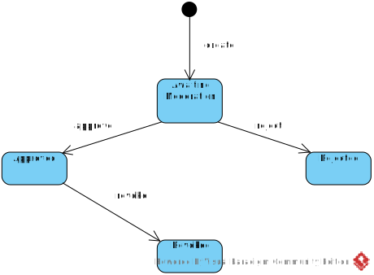

[На русском](https://github.com/ciukstar/eventqr/blob/master/README.ru.md)

# EventQr

Event and Attendance Management

## Overview

[EventQr](https://eventqr-i4rimw5qwq-de.a.run.app) allows managers to register events, notify users about upcoming events and track attendance.


*Use Case Diagram*


## User roles

* Event manager  

  An event manager can create events, send notifications, assign participants only to those events that he manages.
  
* Data administrator  

  Data administrators have full access to all events and data.


* Superuser  

  * Username  
    ```$YESOD_SUPERUSER_USERNAME```
  * Password  
    ```$YESOD_SUPERUSER_PASSWORD```
  
  A superuser account is defined at deployment time. The superuser manages other users and grants or revokes administrator privileges to specific users.

## Integration with external APIs

* Email: [Gmail API](https://developers.google.com/gmail/api/guides)  

  * Client id  
    ```$YESOD_GOOGLE_CLIENT_ID```
  * Client secret  
    ```$YESOD_GOOGLE_CLIENT_SECRET```

* Google Secret Manager: [Secret Manager API](https://cloud.google.com/secret-manager/docs/reference/rest)  

  * Project ID  
    ```$YESOD_GCLOUD_PROJECT_ID```

## Basic entities

*Entity Relationship Diagram*


### Card
...

### Moderation

*State machine diagram*



## Demo

[Click here to see demo](https://eventqr-i4rimw5qwq-de.a.run.app)
