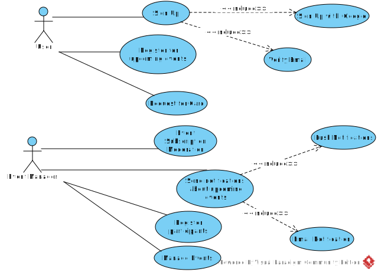
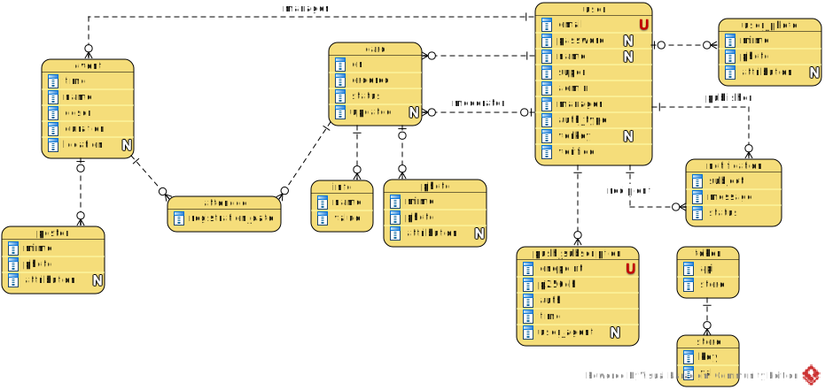

[На русском](https://github.com/ciukstar/eventqr/blob/master/README.ru.md)

# EventQr

Event and Attendance Management

## Overview

[EventQr](https://eventqr-i4rimw5qwq-de.a.run.app) allows managers to register events, notify users about upcoming events and track attendance.

*Use Case Diagram*

*Entity Relationship Diagram*

## Demo

[Click here to see demo](https://eventqr-i4rimw5qwq-de.a.run.app)
