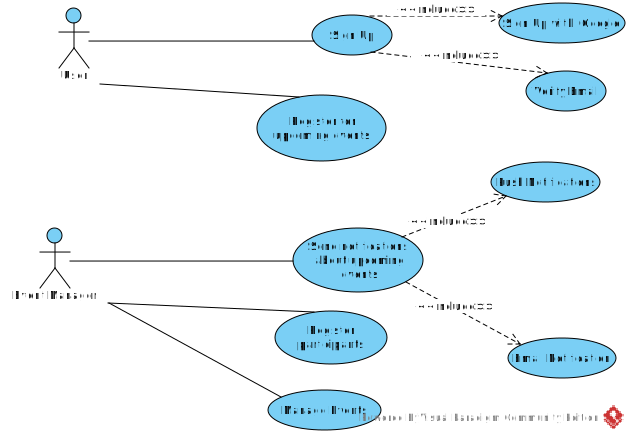
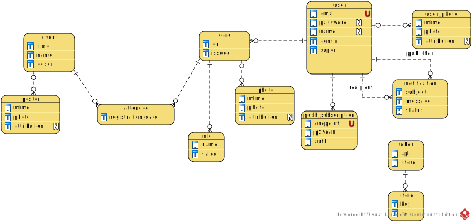

[In english](https://github.com/ciukstar/eventqr/blob/master/README.md)

# EventQr

Управление мероприятиями и посещаемостью

## Обзор

[EventQr](https://eventqrru-i4rimw5qwq-de.a.run.app) позволяет менеджерам регистрировать мероприятия, уведомлять пользователей о предстоящих мероприятиях и отслеживать посещаемость.


*Диаграмма вариантов использования*


## Роли пользователей

* Менеджер мероприятий  

  Менеджер мероприятий может создавать мероприятия, отправлять уведомления, назначать участников только на те мероприятия, которыми он управляет.

* Администратор данных  

  Администраторы данных имеют полный доступ ко всем событиям и данным.

* Суперпользователь  

  * Имя пользователя  
    ```$YESOD_SUPERUSER_USERNAME```
  * Пароль  
    ```$YESOD_SUPERUSER_PASSWORD```

  Учетная запись суперпользователя определяется во время развертывания. Суперпользователь управляет другими пользователями и предоставляет или отзывает права администратора конкретным пользователям.

## Интеграция с внешними API

* Электронная почта: [Gmail API](https://developers.google.com/gmail/api/guides?hl=ru)  

  * Идентификатор клиента  
    ```$YESOD_GOOGLE_CLIENT_ID```
  * Секрет клиента  
    ```$YESOD_GOOGLE_CLIENT_SECRET```

* Google Secret Manager: [Secret Manager API](https://cloud.google.com/secret-manager/docs/reference/rest)  

  * Идентификатор проекта  
    ```$YESOD_GCLOUD_PROJECT_ID```


*Диаграмма взаимосвязи сущностей*


## Демо

[Нажмите здесь, чтобы увидеть демо](https://eventqrru-i4rimw5qwq-de.a.run.app)
